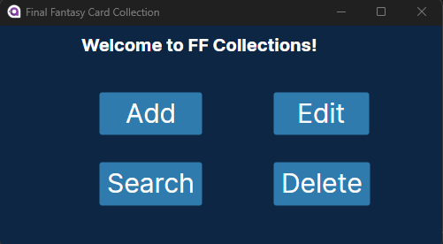
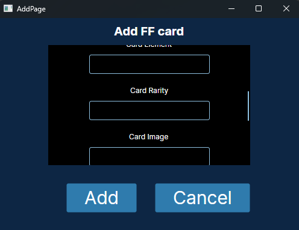
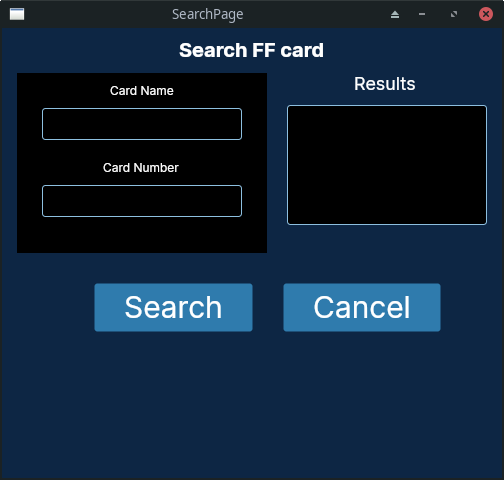

# FF GUI (Avalonia UI)

GUI for the [FFcollection](https://github.com/TcPirate1/FFTCG_collection).

Margin/Padding (left, top, right, bottom).

Designing and modifying UI. [Alignment, Padding & Margins](https://docs.avaloniaui.net/docs/basics/user-interface/building-layouts/alignment-margins-and-padding) and [Panel Overview](https://docs.avaloniaui.net/docs/basics/user-interface/building-layouts/panels-overview)

## Build

Ensure you have a `.NET SDK` installed and run `dotnet run` in the project directory.

If using `VSCode`, the extension requires [.NET 8.0 core](https://marketplace.visualstudio.com/items?itemName=AvaloniaTeam.vscode-avalonia) to use previewer and code completion. However if you're not worried about either then just a `.NET SDK` is required.

## TODO

- Connect to MongoDB (Installed required nuget packages).
- Read, Add, Edit, Delete (in this order).

## Pages

